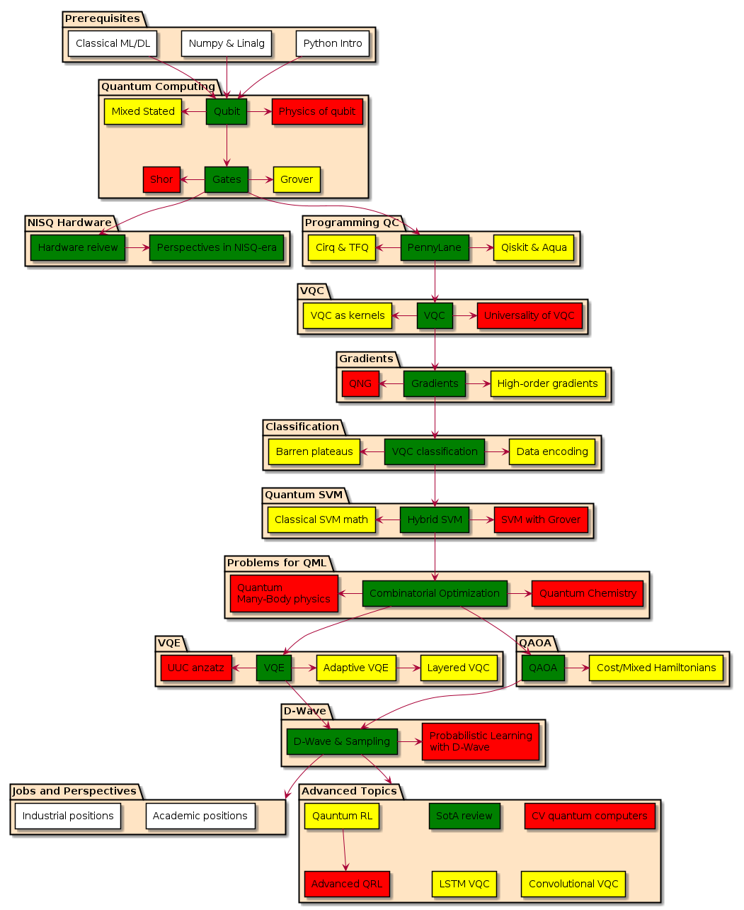

# QMLCourse

Main repository of the course.

1. [Contributing Guide](#guide)
2. [Course Program](#program)
   1. [How-to go through the course?](#schema)
3. [Our Team](#team)
4. [Bibtex Citations](#bibtex)

## Contributing Guide <a name="guide"></a>

- [Contributing Guide](./CONTRIBUTING.md)

## Course Program <a name="program></a>



### How to read the schema? <a name="schema"></a>

- **WHITE** -- introductory blocks covering prerequisites for the rest of the course;
- **GREEN** -- main flow of the course with simple introductory lectures on QC and QML;
- **YELLOW** -- facultative lectures that are highly recommended and which explain additional topics about QML and QC;
- **RED** -- advanced level lectures which deeply explain the math and the principles underlying QML.

## Our Team <a name="team"></a>

- [Our Team](./Team.md)

## Bibtex <a name="bibtex"></a>

```bibtex
@misc{qmlcourse2021,
  author = {Sinchenko SA et al.},
  title = {QMLCourse.ai},
  year = {2021},
  publisher = {GitHub},
  journal = {GitHub repository},
  howpublished = {\url{https://github.com/SemyonSinchenko/qmlcourse.ai}},
}
```
